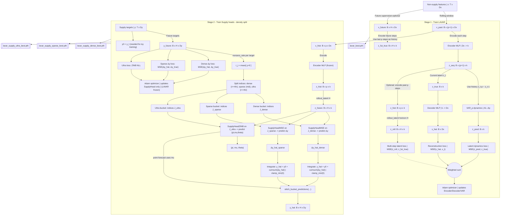

# LAVAR: Latent Autoencoder VAR for Forecasting (Reference Implementation)

[](#citation)
[](#installation)
[](https://pytorch.org/)
[](https://docs.pydantic.dev/)
[](https://github.com/astral-sh/uv)

This repository contains a minimal, research-oriented PyTorch implementation of **LAVAR** (Latent Autoencoder VAR) and a **two-stage** training procedure for forecasting future “supply” targets from non-supply covariates.

> **Status**: research code (intentionally compact, with a small number of moving parts).

## Overview

Given a multivariate time series of non-supply features \(x_t \in \mathbb{R}^{D_x}\) and supply targets \(y_t \in \mathbb{R}^{D_y}\), LAVAR learns a low-dimensional latent state \(z_t \in \mathbb{R}^k\) such that:

- **Observation model (nonlinear)**: \(x_t \approx g_\theta(z_t)\) via an MLP encoder/decoder.
- **Latent dynamics (linear)**: \(z_t \approx \sum_{i=1}^{p} A_i z_{t-i}\) (a VAR(\(p\)) model).

Training is **two-stage**:

- **Stage 1 (LAVAR)**: learn encoder/decoder + latent VAR dynamics from \(x\) only, using reconstruction + latent dynamics losses (optionally with multi-step latent supervision).
- **Stage 2 (Supply head)**: freeze the stage-1 latent model and train a small head to map rolled-out future latents to future supplies \(y_{t+1:t+H}\).
  - **Density-split heads (recommended)**: split targets into **dense / sparse / ultra-sparse** buckets by nonzero rate and train a separate head per bucket.

For a more formal, implementation-faithful write-up (with LaTeX math and the exact distributions used), see the documents linked below.

* **[`ACADEMIC(ENGLISH).md`](ACADEMIC_ENG.md)**
* **[`ACADEMIC(KOREAN).md`](ACADEMIC_KOR.md)**


## System diagram (Mermaid)



## Repository layout

- `dataset.py`: `RollingXYDataset` produces `(x_past, x_future, y_future)` rolling windows.
- `models.py`:
  - `LAVAR`: encoder/decoder + `VARDynamics`
  - `LAVARWithSupply`: frozen latent rollout + bucket-specific supply head (NB or ZINB)
- `dynamics.py`: `VARDynamics` implements linear VAR(\(p\)) latent transitions.
- `train_stage1.py`: stage-1 optimization (reconstruction + latent dynamics + optional multi-step latent supervision).
- `train_stage2.py`: stage-2 optimization (freeze `lavar`, train `supply_head` only).
- `config.py`: `LAVARConfig` hyperparameters.
- `losses.py`: optional Poisson NLL for nonnegative count-like supplies.

## Installation

This repo is intentionally lightweight and uses `pyproject.toml` (Python \(\ge 3.12\)).

### Option A: `uv` (recommended)

```bash
uv sync
```

### Option B: `pip`

```bash
python -m venv .venv
source .venv/bin/activate
pip install -U pip
pip install torch pandas pydantic
```

## Data contract

The training code expects **already-aligned** tensors:

- **Non-supply covariates**: `x` with shape `(T, Dx)`
- **Supply targets**: `y` with shape `(T, Dy)`

Windowing is handled by `RollingXYDataset`:

- `x_past = x[t-p : t+1]` has shape `(p+1, Dx)` (VAR history + current)
- `x_future = x[t+1 : t+H+1]` has shape `(H, Dx)` (optional latent rollout supervision)
- `y_future = y[t+1 : t+H+1]` has shape `(H, Dy)` (stage-2 supervision)

## Reproducing the training loop (minimal example)

This repo currently exposes the stage trainers as functions. The snippet below is a minimal end-to-end run on dummy data; swap the dummy tensors for your real, preprocessed time series.

```python
import torch
from torch.utils.data import DataLoader, random_split

from config import LAVARConfig
from dataset import RollingXYDataset, RollingXYDatasetWithY0
from models import LAVAR, LAVARWithSupply
from train_stage1 import stage1_train_lavar
from train_stage2 import stage2_train_supply_density_split

cfg = LAVARConfig(
    device="cpu",
    p=7,
    horizon=14,
    latent_dim=8,
    epochs_lavar=5,
    epochs_supply=5,
    multi_step_latent_supervision=True,
)

T, Dx, Dy = 1000, 20, 3
x = torch.randn(T, Dx)
y = torch.randn(T, Dy)

ds = RollingXYDataset(x, y, p=cfg.p, horizon=cfg.horizon)
train_len = int(0.8 * len(ds))
val_len = len(ds) - train_len
train_ds, val_ds = random_split(ds, [train_len, val_len])

train_loader = DataLoader(train_ds, batch_size=cfg.batch_size, shuffle=True, num_workers=cfg.num_workers)
val_loader = DataLoader(val_ds, batch_size=cfg.batch_size, shuffle=False, num_workers=cfg.num_workers)

lavar = LAVAR(
    input_dim=Dx,
    latent_dim=cfg.latent_dim,
    transition_order=cfg.p,
    encoder_hidden_dims=cfg.encoder_hidden,
    decoder_hidden_dims=cfg.decoder_hidden,
)
stage1_train_lavar(lavar, train_loader, val_loader, cfg)

model = LAVARWithSupply(
    lavar=lavar,
    supply_dim=Dy,
    horizon=cfg.horizon,
    supply_hidden=cfg.supply_hidden,
)

# Stage 2 (density split): trains 3 heads (dense=raw Δy w/ MSE, sparse=raw Δy w/ MSE, ultra=ZINB)
# Note: delta-MSE heads require y0=y[t], so use RollingXYDatasetWithY0 for stage 2 loaders.
ds2 = RollingXYDatasetWithY0(x, y, p=cfg.p, horizon=cfg.horizon)
train_ds2, val_ds2 = random_split(ds2, [train_len, val_len])
train_loader2 = DataLoader(train_ds2, batch_size=cfg.batch_size, shuffle=True, num_workers=cfg.num_workers)
val_loader2 = DataLoader(val_ds2, batch_size=cfg.batch_size, shuffle=False, num_workers=cfg.num_workers)
split = stage2_train_supply_density_split(lavar, train_loader2, val_loader2, cfg)
```

## Outputs / checkpoints

The trainers write checkpoints to the current working directory:

- `lavar_best.pth`: best stage-1 model (by validation loss)
- `lavar_supply_best.pth`: best stage-2 model (by validation loss)

## Configuration

Hyperparameters live in `config.py` (`LAVARConfig`). Stage 2 is intentionally simple and only supports **density-split training** via:

- **Bucketing**: `dense_nonzero_rate_thr`, `ultra_nonzero_rate_thr`
- **Training**: `lr_supply`, `epochs_supply`

## Citation

If you use this code, please cite the associated paper:

```bibtex
@article{lavar_tbd,
  title   = {LAVAR: Latent Autoencoder VAR for Forecasting},
  author  = {TBD},
  journal = {TBD},
  year    = {TBD}
}
```

## Acknowledgements

Built with PyTorch; inspired by classic state-space modeling and VAR-style latent dynamics regularization.
